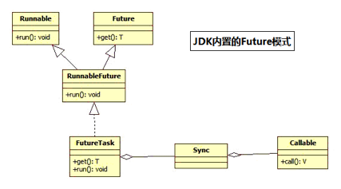

Future模式
=============

某一段程序提交了一个请求，期望得到一个答复。在传统单线程环境下，必须等服务程序返回结果后，才能进行其它处理。而在Future模式中，调用方式改为异步，在主调用函数中，原来等待返回结果的时间段，可以处理其它事务。

Future模式的主要参与者

参与者		| 作用
---			| ---
Main		| 系统调用，调用Client发出请求
Client		| 返回Data对象，立即返回FutureData,并开启ClientThread线程装配RealData
Data		| 返回数据的接口
FutureDate	| Future数据，构造很快，但是是一个虚拟的数据，需要装配RealData
RealData	| 真实数据，但是构造较慢


#Future模式代码实现

###(1)	Data.java

```java
public interface Data {
    public String getResult();
}
```

###(2)	RealData.java

```java
public class RealData implements Data {
    protected final String result;
    public RealData(String para) {
    	//RealData的构造可能很慢，需要用户等待很久
    	StringBuffer sb=new StringBuffer();
        for (int i = 0; i < 10; i++) {
        	sb.append(para);
            try {
                Thread.sleep(100);
            } catch (InterruptedException e) {
            }
        }
        result=sb.toString();
    }
    public String getResult() {
        return result;
    }
}
```

###(3)	FutureData.java

```java
public class FutureData implements Data {
    protected RealData realdata = null;
    protected boolean isReady = false;
    public synchronized void setRealData(RealData realdata) {
        if (isReady) {                        
            return;     
        }
        this.realdata = realdata;
        isReady = true;
        notifyAll();
    }
    public synchronized String getResult() {
        while (!isReady) {
            try {
                wait();
            } catch (InterruptedException e) {
            }
        }
        return realdata.result;
    }
}
```

###(4)	Client.java
```
public class Client {
    public Data request(final String queryStr) {
        final FutureData future = new FutureData();
        // RealData的构建很慢
        new Thread() {                                      
            public void run() {                             
                RealData realdata = new RealData(queryStr);
                future.setRealData(realdata);
            }                                               
        }.start();
        return future;
    }
}
```

###(5)	Main.java
```java
public class Main {
    public static void main(String[] args) {
        Client client = new Client();
        
        Data data = client.request("a");
        System.out.println("请求完毕");
        try {
        	//这里可以用一个sleep代替了对其它业务逻辑的处理
            Thread.sleep(2000);
        } catch (InterruptedException e) {
        }
        	//使用真实的数据
        System.out.println("数据 = " + data.getResult());
    }
}
```

```
输出结果：
请求完毕
数据 = aaaaaaaaaa
```

#JDK实现


###(1)	RealData.java

```java
import java.util.concurrent.Callable;

public class RealData implements Callable<String> {
    private String para;
    public RealData(String para){
    	this.para=para;
    }
	@Override
	public String call() throws Exception {
    	
    	StringBuffer sb=new StringBuffer();
        for (int i = 0; i < 10; i++) {
        	sb.append(para);
            try {
                Thread.sleep(100);
            } catch (InterruptedException e) {
            }
        }
        return sb.toString();
	}
}
```

###(2)	Main.java

```java
import java.util.concurrent.ExecutionException;
import java.util.concurrent.ExecutorService;
import java.util.concurrent.Executors;
import java.util.concurrent.FutureTask;

public class Main {
    public static void main(String[] args) throws InterruptedException, ExecutionException {
    	//构造FutureTask
        FutureTask<String> future = new FutureTask<String>(new RealData("a"));
        ExecutorService executor = Executors.newFixedThreadPool(1);
        //执行FutureTask，相当于上例中的 client.request("a") 发送请求
        //在这里开启线程进行RealData的call()执行
        executor.submit(future);
        System.out.println("请求完毕");
        try {
        //这里依然可以做额外的数据操作，这里使用sleep代替其他业务逻辑的处理
            Thread.sleep(2000);
        } catch (InterruptedException e) {
        }
        //相当于上例中得data.getContent()，取得call()方法的返回值
        //如果此时call()方法没有执行完成，则依然会等待
        System.out.println("数据 = " + future.get());
    }
}
```

```
输出结果：
请求完毕
数据 = aaaaaaaaaa
```
