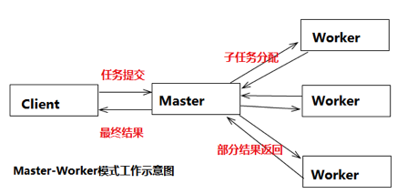

Master-Worker模式
=====
	
Master-Worker模式是常用的并行模式。它的核心思想是，系统由两类进程协作工作：Master进程，Worker进程。Master进程负责接收和分配任务，worker进程负责处理子任务。当各个Worker进程将子任务处理完成后，将结果返回给Master进程，由Master进程做归纳和汇总，从而得到系统的最终结果。




#代码实现

应用Master-Worker框架，实现计算立方和的应用，并计算1~100的立方和。

计算任务被分解为100个任务，每个任务仅用于计算单独的立方和。Master产生固定个数的worker来处理所有这些子任务。Worker不断地从任务集体集合中取得这些计算立方和的子任务，并将计算结果返回给Master.Master负责将所有worker累加，从而产生最终的结果。在计算过程中，Master和Worker的运行也是完全异步的,Master不必等所有的Worker都执行完成后，就可以进行求和操作。Master在获得部分子任务结果集时，就可以开始对最终结果进行计算，从而进一步提高系统的并行度和吞吐量。

###(1)	Master.java

```java
import java.util.HashMap;
import java.util.Map;
import java.util.Queue;
import java.util.concurrent.ConcurrentHashMap;
import java.util.concurrent.ConcurrentLinkedQueue;

public class Master {
	// 任务队列
	protected Queue<Object> workQueue = new ConcurrentLinkedQueue<Object>();
	// Worker线程队列
	protected Map<String, Thread> threadMap = new HashMap<String, Thread>();
	// 子任务处理结果集
	protected Map<String, Object> resultMap = new ConcurrentHashMap<String, Object>();

	// 是否所有的子任务都结束了
	public boolean isComplete() {
		for (Map.Entry<String, Thread> entry : threadMap.entrySet()) {
			if (entry.getValue().getState() != Thread.State.TERMINATED) {
				return false;
			}
		}
		return true;
	}

	// Master的构造，需要一个Worker进程逻辑，和需要的Worker进程数量
	public Master(Worker worker, int countWorker) {
		worker.setWorkQueue(workQueue);
		worker.setResultMap(resultMap);
		for (int i = 0; i < countWorker; i++)
			threadMap.put(Integer.toString(i),
					new Thread(worker, Integer.toString(i)));
	}

	// 提交一个任务
	public void submit(Object job) {
		workQueue.add(job);
	}

	// 返回子任务结果集
	public Map<String, Object> getResultMap() {
		return resultMap;
	}

	// 开始运行所有的Worker进程，进行处理
	public void execute() {
		for (Map.Entry<String, Thread> entry : threadMap.entrySet()) {
			entry.getValue().start();
		}
	}
}
```


###(2)	Worker.java

```java
import java.util.Map;
import java.util.Queue;

public class Worker implements Runnable {
	// 任务队列，用于取得子任务
	protected Queue<Object> workQueue;
	// 子任务处理结果集
	protected Map<String, Object> resultMap;

	public void setWorkQueue(Queue<Object> workQueue) {
		this.workQueue = workQueue;
	}

	public void setResultMap(Map<String, Object> resultMap) {
		this.resultMap = resultMap;
	}

	// 子任务处理的逻辑，在子类中实现具体逻辑
	public Object handle(Object input) {
		return input;
	}

	@Override
	public void run() {
		while (true) {
			// 获取子任务
			Object input = workQueue.poll();
			if (input == null)
				break;
			// 处理子任务
			Object re = handle(input);
			// 将处理结果写入结果集
			resultMap.put(Integer.toString(input.hashCode()), re);
		}
	}
}
```


###(3)	TestMasterWorker.java

```java
import java.util.Map;
import java.util.Set;

import org.junit.Test;

public class TestMasterWorker {

	public class PlusWorker extends Worker {
		public Object handle(Object input) {
			Integer i = (Integer) input;
			return i * i * i;
		}
	}

	@Test
	public void testMasterWorker() {
		Master m = new Master(new PlusWorker(), 5);
		for (int i = 0; i < 100; i++) {
			m.submit(i);
		}
		m.execute();
		int re = 0;
		Map<String, Object> resultMap = m.getResultMap();
		while (resultMap.size() > 0 || !m.isComplete()) {
			Set<String> keys = resultMap.keySet();
			String key = null;
			for (String k : keys) {
				key = k;
				break;
			}
			Integer i = null;
			if (key != null) {
				i = (Integer) resultMap.get(key);
			}
			if (i != null) {
				re += i;
			}
			if (key != null) {
				resultMap.remove(key);
			}
		}

		System.out.println("testMasterWorker:" + re);
	}

	@Test
	public void testPlus() {
		int re = 0;
		for (int i = 0; i < 100; i++) {
			re += i * i * i;
		}
		System.out.println("testPlus:" + re);
	}

}
```

```
执行输出结果：
testMasterWorker:24502500
testPlus:24502500
```
